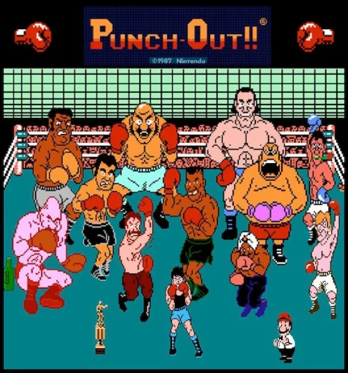

# Punch-Out

Ég mun gera emulator um Punch-Out leikinn sem var gefinn út á Nintendo NES. Punch-Out er boxing leikur þar sem þú ert að spila einn character sem heitir Little Mac 
í gegnum boxing ferilinn hans og þú munt fara í gegnum fullt af andstæðingum sumir góður, sumir slæmir. 

---

Andstæðingarnir koma í eftirfarandi röð:
 - Minor Circuit: 
    - Glass Joe
    - Von Káiser
    - Piston Honda
 - Major Circuit: 
    - Don Flamenco
    - King Hippo
    - Great Tiger
    - Bald Bull
- World Circuit: 
    - Piston Honda (again)
    - Soda Popinski
    - Bald Bull (again)
    - Don Flamenco (again)
    - Mr. Sandman
    - Super Macho Man. 
 - THE CHAMPION: 
    - Mike Tyson

---

[Opponent Behaviours](https://www.neoseeker.com/punch-out/faqs/2911548-mike-tysons-opponent.html)

[Visualized behaviour](https://tomorrowcorporation.com/posts/retro-game-internals-punch-out-behavior-script)

[Video Útskýring](https://www.youtube.com/watch?v=tlKW723EOMA)
