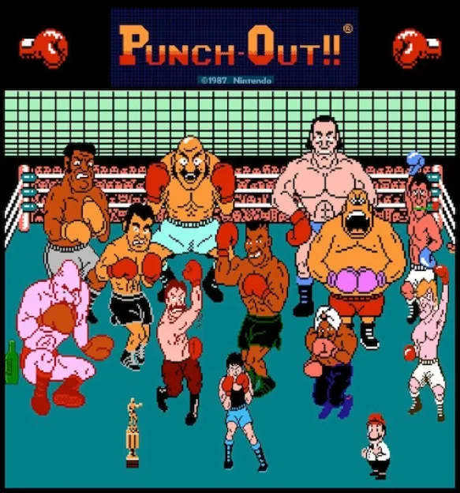

# Punch-Out
---

[Clockify](https://app.clockify.me/shared/643e9b66620628718f063080)

[Verkefni 4 Prototype](https://youtu.be/lROrN00XYZ8)

---

## Útskýring

Ég mun gera emulator um Punch-Out leikinn sem var gefinn út á Nintendo NES. Punch-Out er boxing leikur þar sem þú ert að spila einn character sem heitir Little Mac 
í gegnum boxing ferilinn hans og þú munt fara í gegnum fullt af andstæðingum sumir góður, sumir slæmir. 

---

### Basic Reglur

Einn slagur er gerður af 3 roundum og aðeins 2 leiðir til þess að vinna slaginn. Það er annaðhvort með KO(knockout) og andstæðingurinn stendur ekki upp eða TKO(Technical knockout) sem gerist ef sama manneskjan er KO'd 3 sinnum í sama roundi. Ef andstæðingurinn er KO'd fær hann 10 sek til þess að standa upp. Ef hann nær
því ekki þá vinnur spilarinn. 

### Spilarinn er með health bar, stamina og stjörnur. 
- Health
  - Health barinn er til þess að sjá hversu margar kýlingar í viðbót maður getur tekið áður en maður er KO'd og fer niður þegar maður verður kýldur eða blockar. 
- Stamina
  - Stamina barinn er til þess að sjá margar hreyfinar þú getur gert. Hann fer niður eftir hverja kýlingu, dodge og block. Hann minnkar sérstaklega mikið þegar maður missir kýlingu. 
- Stjörnur
  - Stjörnurnar fær maður í gegnum leikinn með því að kýla andstæðingin þegar hann á ekki von á því. Stjörnurnar lætur mann geta gert uppercut og ein stjarna hverfur þegar maður verður hittur eða blockar.

Ef spilarinn verður KO'd þá verður hann að hægri og vinstri smella eins hratt og hann getur til þess að standa aftur upp og verður það erfiðara eftir hvert skipti sem hann verður KO'd.

### Hvernig round myndi fara

Spilarinn og andstæðingurinn byrjar á því að berjast og hægt er að blocka, dodgea eða countera kýlingar þangað til annaðhvort þeirra verður KO'd eða TKO'd. Andstæðingar eru tölvur sem stundum hafa ákveðið sem þau ætla að gera eins og t.d. að kýla eða uppercut. Sumir andstæðingar hafa Special Move og nota það á ákveðnum tíma leiksins. Það er hægt að countera öll special moves en oft er tímasetningin mjög erfið.

---

Andstæðingarnir koma í eftirfarandi röð:
 - Minor Circuit: 
    - Glass Joe
    - Von Káiser
    - Piston Honda
 - Major Circuit: 
    - Don Flamenco
    - King Hippo
    - Great Tiger
    - Bald Bull
- World Circuit: 
    - Piston Honda (again)
    - Soda Popinski
    - Bald Bull (again)
    - Don Flamenco (again)
    - Mr. Sandman
    - Super Macho Man. 
 - THE CHAMPION: 
    - Mike Tyson

---

## Controls

| Takki | Hreyfing |
| ----------- | ----------- |
| Vinstri smellur | Vinstri líkams kýling |
| Hægri smellur | Hægri líkams kýling |
| W + vinstri smellur | Jab með vinstri hönd |
| W + Hægri smellur | Jab með hægri hönd |
| A | Dodge til vinstri |
| D | Dodge til hægri |
| S | Block |
| S (x2) | Duck |
| Space | Uppercut (Notar stjörnu) |

---

### Ítarlegri upplýsingar hvernig leikurinn virkar

Andstæðingurinn er með fullt af mismunandi kýlingum sem hann getur gert. Allir andstæðingar eru með sinn eigin AI eða moves sem þeir ætla að gera en þær get breyst miðað við hvað spilarinn gerir. Ef við tökum til dæmis Von Kaiser og hvernig hann hagar sér þá frá 0:00 - 0:10 þá gerir hann slow paced straight jabs og svo frá 0:10 - 1:00 þá gerir hann medium paced straight jabs en ef maður reynir að kýla þá gerir hann ekki neitt til baka nema bara blocka. aðrir andstæðingar hafa svona counter moves þar sem þeir gera árás beint eftir að þú kýlir þá. Von Kaiser er með hendurnar þar sem þú ert að plana um að kýla þannig ef þú ert að halda inni W þá færir hann hendurnar upp til þess að getað blockað jabs frá þér en ef þú ert ekki að halda inni W þá færir hann hendurnar niður til þess að getað blockað body kýlingar. Allir andstæðingar eru með 5 mismunandi gildi sem halda um hvar þeir eru að blocka og hvar ekki. Það verður haldið í kringum þær upplýsingar með eftirfarandi, þannig á öllum tímum mun andstæðingurinn hafa array sem inniheldur [left jab, right jab, left punch, right punch, uppercut] og getur verið 0, 1, 2 eða 3. 
- 0 Þýðir að ef þú kýlir hann þarna muntu fá stjörnu. 
- 1 þýðir að hann er ekki að vernda það svæði og þú munt hitta ef þú kýlir hann þarna. 
- 2 þýðir að hann er blocka þarna.
-  3 þýðir að hann er búinn að dodgea

Hegðun anstæðingsins fer eftir tímasetningu og hvað spilarinn gerir. Frá því sem ég er búinn að finna so far er Von Kaiser með mjög einfalda skriptu en aðrir andstæðingar hafa flóknari
skriptur og t.d. response við hvað playerinn gerir. Von Kaiser virkar eftirfarandi 
- 0:00: Slow paced straight jabs
- 0:10: Medium paced straight jabs
- 1:00: Slow paced sraight jabs
- 2:00: Medium paced straight jabs
- 3:00: Medium paced straight jabs
- 5:00: Slow paced sraight jabs
- 5:20: Fast paced straight jabs
- 6:00: Fast paced straighy jabs
- Eftir að hann eða Little Mac er KO'd þá gerir hann 2x Uppercut
- Þegar Little Mac er exhausted þá gerir hann uppercut þangað til hann er ekki lengur exhausted

#### Helstu hindranir (gisk)

- Vita hvernær það er hitt eða maður er hittur og hvort maður er að blocka eða ekki
- Hegðun Andstæðinga
- Tímasetning fyrir stjörnur og counters og special moves

---

### Hjálpargögn um hvernig leikurinn virkar

[Opponent Behaviours](https://www.neoseeker.com/punch-out/faqs/2911548-mike-tysons-opponent.html)

[Visualized behaviour](https://tomorrowcorporation.com/posts/retro-game-internals-punch-out-behavior-script)

[Video Útskýring](https://www.youtube.com/watch?v=tlKW723EOMA)

[Hvar er að finna behaviour Scripts Held ég](https://github.com/nmikstas/mike-tysons-punch-out-disassembly)

[Usefull Images](https://nesmaps.com/maps/MikeTysonsPunchOut/MikeTysonsPunchOutBG.html)

[Usefull Images 2](https://www.mariouniverse.com/sprites-nes-mtp/)

